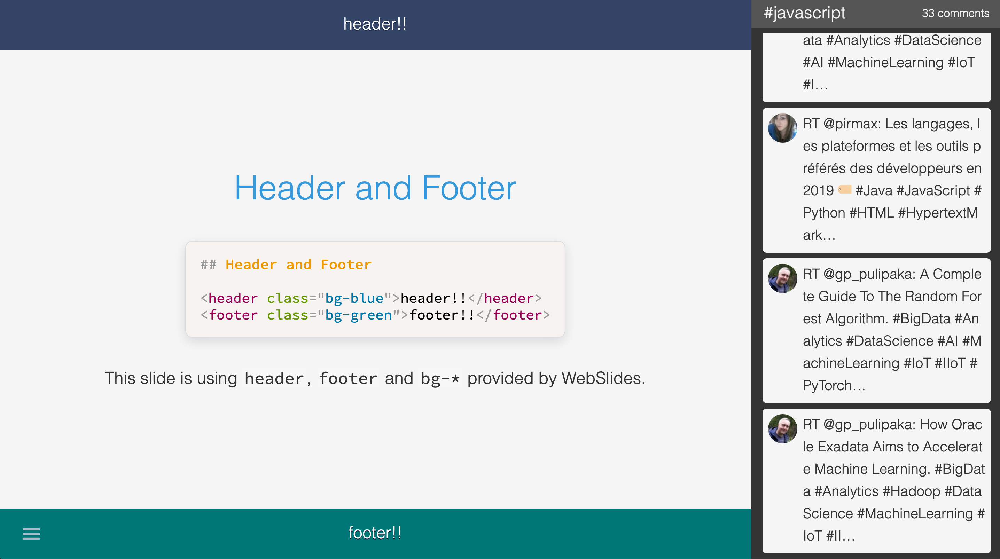
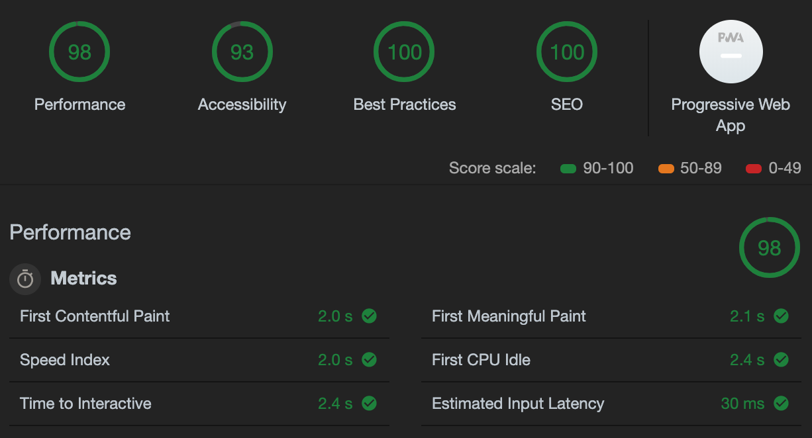

<div align="center">
  
</div>

<div align="center">
  <strong>📝 Makes slides with Markdown easily.</strong>
</div>

<br />

[](https://www.npmjs.com/package/fusuma)
[](https://dev.azure.com/hiroppy/fusuma)
[](https://codecov.io/gh/hiroppy/fusuma)

Just write Markdown and create cool slides.😎

## Features

- Zero Config
- supports [mdx](https://github.com/mdx-js/mdx)
  - you can write React Components into Markdown
- supports [WebSlides](https://webslides.tv) as Slide UI
- supports [Presentation API](https://developer.mozilla.org/en-US/docs/Web/API/Presentation_API) (Chrome, Firefox)
  - also, Fusuma works even without Presentation API (uses localstorage)
- supports [Screen Capture API](https://developer.mozilla.org/en-US/docs/Web/API/Screen_Capture_API/Using_Screen_Capture) (Chrome, Firefox)
  - it will help live coding, etc
- supports drawing like Power Pointer's pointer feature
- 100% SEO
- records your voice and does time travel on slides timeline (Chrome, Firefox)
- customizes JavaScript and CSS freely

## Modes

- Start Mode (development)
- Build Mode (production)
- [Presentation Mode](#presenter-mode)
  - Fusuma provides a speaker note, timer, slide timeline and recording feature
- [Live Mode](#live-mode)
  - Fusuma can stream tweets when you give a speech
- Deploying to GitHub Pages
- Exporting slides as PDF

## Demos

- [Introducing Fusuma](https://hiroppy.github.io/fusuma/intro) [[repository](/samples/intro)]
- others [[repository](https://github.com/hiroppy/slides#my-slides)]

You can also try Fusuma in Gitpod, a one-click online IDE for GitHub:

[](https://gitpod.io/#https://github.com/hiroppy/fusuma/blob/master/samples/intro/slides/0-title.md)

## Getting Started

Node versions > v8

Just execute the following two lines for executing, generating and deploying slides!

```sh
$ npm i fusuma -D # yarn add fusuma --dev
$ mkdir slides && echo '# Hello😄' > slides/title.md

# --- Tree ---
$ tree -a
.
└── slides
    └── title.md

1 directory, 1 files

# --- executable tasks---
$ npx fusuma init     # customize fusuma configuration
$ npx fusuma start    # development
$ npx fusuma build    # build as NODE_ENV=production
$ npx fusuma live     # start live mode
$ npx fusuma deploy   # deploy to github pages
$ npx fusuma pdf      # export as PDF from HTML

# --- help
$ npx fusuma --help
$ npx fusuma live --help # see help for a specific command
```

When `npx fusuma start` is executed, fusuma will create a slide as follows and serve `localhost:8080`.


And you can customize the slide using CSS and JS.

## Directory Structure

Please see [samples/intro](/samples/intro) or [issue-verifier/fusuma](https://github.com/issue-verifier/fusuma).

**Slide order is numeric, alphabetical.**

```
.
├── .fusumarc.yml       <-- [optional] the configuration file
├── index.js            <-- [optional] js extending fusuma
├── slides              <-- [required] slides written by Markdown or HTML
│   ├── 0-title.md
│   ├── 01-content.md
│   ├── 02-body
│   │   └── 0-title.md
│   └── 03-end.md
└── style.css           <-- [optional] css extending fusuma

2 directories, 7 files
```

The slide display order is as follows.

`0-title.md` -> `01-content.md` -> `0-title.md`(in `02-body`) -> `03-end.md`

Or slides can be divided by `---` like below.

```markdown
## Hello

This is the first slide.

---

## 🤭

This is the second slide.
```

Also, you can use react components if you change the extension from `.md` to `.mdx`.

```markdown
<!-- 0-title.mdx -->

import { Sample } from './scripts/Sample';

<Sample />

---

## 🤭

This is the second slide.
```

```js
// Sample.js

import React from 'react';

export const Sample = () => <p>Hello from jsx!!</p>;
```

## Configuration File

This file is optional, but many customizations will be possible.  
Supports for `yaml` and `js` and it can be generated by running `fusuma init`.

### .fusumarc.yml

<details>

```yml
meta:
  url: https://slides.hiroppy.me
  title: the present and future of JavaScript
  description: Explain how specifications are determined and how it will be in the future.
  thumbnail: https://avatars1.githubusercontent.com/u/1725583?v=4&s=200
  siteName: slides.hiroppy.me
  sns:
    - twitter
    - hatena
slide:
  loop: true
  sidebar: true
  targetBlank: true
  showIndex: false
  isVertical: false
  code:
    languages:
      - javascript
    plugins:
      - line-numbers
    theme: default
  math: false
extends:
  js: index.js
  css: style.css
```

</details>

### .fusumarc.js

<details>

```js
module.exports = {
  meta: {
    url: 'https://slide.hiroppy.me',
    title: 'test-test',
    description: 'test',
    thumbnail: 'url',
    siteName: 'siteName',
    sns: ['twitter', 'hatena']
  },
  slide: {
    loop: true,
    sidebar: true,
    targetBlank: true,
    showIndex: false,
    isVertical: false,
    code: {
      languages: ['javascript'],
      plugins: ['line-numbers'],
      theme: 'default'
    },
    math: false
  },
  extends: {
    js: 'index.js',
    css: 'style.css'
  }
};
```

</details>

## Extend JS and CSS

You can extend JS and CSS when `extends.js` or `extends.css` in `.fusumarc` is specified by a file path.

The following features are available by default:

- JS
  - uses Babel, so you can use ESM(`import`/`export`), and ES2018
- CSS
  - uses [postcss-preset-env](https://github.com/csstools/postcss-preset-env), so you can use the cssnext syntax up to level:1
  - `@import`

## Slide Syntax

Fusuma has some slide syntax like create a table of contents automatically, etc.  
See the intro slide. [Syntax Provided by Fusuma](./samples/intro/slides/04-slide.md)

## Code Syntax Highlighting

Fusuma uses [Prism.js](https://prismjs.com/).  
You can specify `languages`, `plugins`, `theme` to `.fusumrc`.
Please see [babel-plugin-prismjs](https://github.com/mAAdhaTTah/babel-plugin-prismjs) for detail.

```yml
slide:
  code:
    languages: # the default is ['javascript']
      - javascript
    plugins: # the default is []
      - line-numbers
    theme: default # the default is "default"
```

[Playground of Prism.js](https://prismjs.com/test.html#language=markup)

## Presenter Mode

### Features

- show your slide note
- set a timer
- record your actions and voice, and do time-travel
- draw lines on the slide

### Start Up

1. open Sidebar(click the bottom right button(三))
2. click the PC monitor icon
3. if you use Chrome, you can choose select cast device
4. if you use a browser that does not support Presentation API, a new window will be created


### Practice Presentation

Fusuma records the slide operation performed by you when you start a timer.  
And, by recording audio, you can also do time travel.

When you start the timer, the timeline will be recorded.  
When you reset the timer, the timeline will be reset.


Recording Mode: See [the movie](https://twitter.com/about_hiroppy/status/1142378836639789056).

### Drawing

When you write characters on the host side, it will be reflected on the client side in real time.


## Live Mode

Fusuma can fetch tweets from Twitter. In addition, fusuma have an api endpoint.  
If you specify a `keyword` and `authentication keys`, fetching from twitter will be enabled.  
Since comments can be sent to fusuma itself, you can use in the private case.  
Also, this mode can run with Presenter Mode.

```sh
# create .env
$ npx fusuma init -s live
# edit .env and add .env to .gitignore
$ npx fusuma live -w '@nodejs' # npx fusuma live --help
# also, you can deploy to other servers
$ open http://localhost:3000
```



### Post a comment

```sh
$ curl -X POST -H "Content-Type: application/json" -d '{"text":"hello:)"}' localhost:3000/api/comments
```

## Audits

[This slide](https://hiroppy.github.io/fusuma/issues/#slide=1) is very simple, so this is a measure of the maximum performance fusuma can deliver.

```
* URL: https://hiroppy.github.io/fusuma/issues/#slide=1
* Device: No emulation
* Network throttling: 150 ms TCP RTT, 1,638.4 Kbps throughput (Simulated)
* CPU throttling: 4x slowdown (Simulated)
* User agent (host): Mozilla/5.0 (Macintosh; Intel Mac OS X 10_14_5) AppleWebKit/537.36 (KHTML, like Gecko) Chrome/74.0.3729.169 Safari/537.36
* User agent (network): Mozilla/5.0 (Macintosh; Intel Mac OS X 10_14_5) AppleWebKit/537.36 (KHTML, like Gecko) Chrome/74.0.3729.169 Safari/537.36
* CPU/Memory Power: 1052
```



The values of `Accessibility` and `Best Practices` depend on the user because the user writes HTML(Markdown).  
If you want to make `SEO` score 100%, you should fill in the `.fusumarc.yml`.

## Development

### Setup

```sh
$ git clone git@github.com:hiroppy/fusuma.git
$ cd fusuma
$ npm i
$ npm run setup
```

### Link local packages

```sh
$ npx lerna add @fusuma/xxx --scope=@fusuma/yyy
```

see https://github.com/lerna/lerna/tree/master/commands/add

## API

```js
const start = require('@fusuma/task-start');
const build = require('@fusuma/task-build');
const pdf = require('@fusuma/task-pdf');
const deploy = require('@fusuma/task-ghp');
const init = require('@fusuma/task-init');
```
