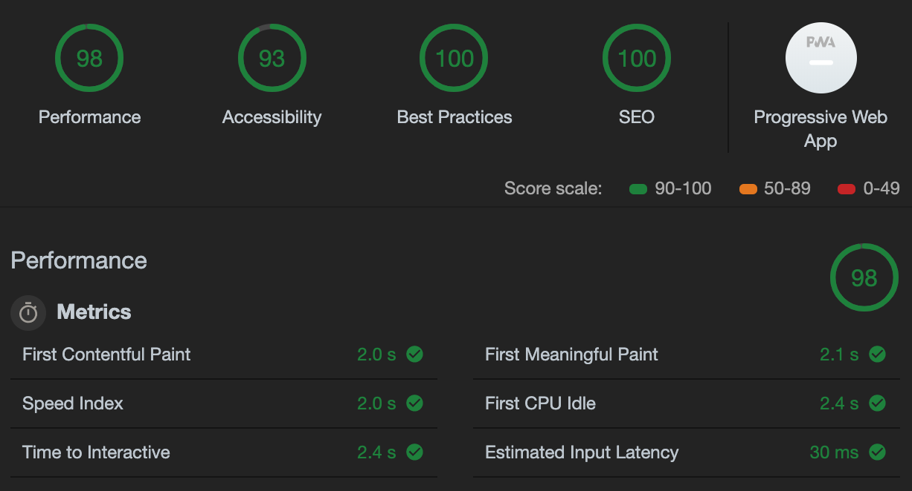

<div align="center">
  
</div>

<div align="center">
  <strong>📝 Makes slides with Markdown easily.</strong>
</div>

<br />

[](https://www.npmjs.com/package/fusuma)
[](https://dev.azure.com/hiroppy/fusuma)
[](https://codecov.io/gh/hiroppy/fusuma)

Just write Markdown and create cool slides.😎

## **Please see [Website](https://hiroppy.github.io/fusuma/) for more details!**

## Features

- Zero Config
- Slide syntax are Markdown and [MDX](https://github.com/mdx-js/mdx)
- Supports Code syntax Highlight, MathJax, Diagrams, and Flowcharts
- Slide UI is [WebSlides](https://webslides.tv)
- Supports SEO and OGP
  - Generates ogp image automatically
- Customizes JavaScript and CSS freely
- Adds a Sidebar on Slides
  - share buttons
  - ToC

## Modes

- Development Mode
- Build Mode
- [Presentation Mode](#presenter-mode)
  - Speaker Note
  - Timer
  - Recording your page actions and voice
  - Using a Fluorescent Marker on the slides
- [Live Mode](#live-mode)
  - Streaming tweets and comments
- Deploying to GitHub Pages
- Exporting slides as PDF

## Demos

- [Introducing Fusuma](https://hiroppy.github.io/fusuma/intro) [[repository](/samples/intro)]
- Others [[repository](https://github.com/hiroppy/slides#my-slides)]

You can also try Fusuma in Gitpod, a one-click online IDE for GitHub:

[](https://gitpod.io/#https://github.com/hiroppy/fusuma/blob/master/samples/intro/slides/0-title.md)

## Getting Started

[Getting Started/Preparation](https://hiroppy.github.io/fusuma/docs/getting-started/preparation)

Node versions > v10

Just execute the following two lines for executing, generating and deploying slides!

```sh
$ npm i fusuma -D
$ mkdir slides && echo '# Hello😄' > slides/title.md

# --- Tree ---
$ tree -a
.
└── slides
    └── title.md

# -------- init ---------
# [not mandatory] you can use `init` command to create .fusumarc.yml, slides dir, and style.css

$ npx fusuma init
$ tree -a

# --- Tree ---
.
├── .fusumarc.yml
├── slides
│   └── 0-title.md
└── style.css

# --- executable tasks---
$ npx fusuma init     # create scaffold
$ npx fusuma start    # run server for development
$ npx fusuma build    # build slides as NODE_ENV=production
$ npx fusuma live     # start live mode
$ npx fusuma deploy   # deploy to github pages
$ npx fusuma pdf      # export as PDF from HTML

# --- help
$ npx fusuma --help
$ npx fusuma build --help # see help for a specific command
```

When `npx fusuma start` is executed, fusuma will create a slide as follows and serve `localhost:8080`.


And fusuma adds a Sidebar like below.


## Markdown and MDX

```markdown
## Hello

This is the first slide.

---

## 🤭

This is the second slide.
```

Also, you can use React components!

```markdown
<!-- 0-title.mdx -->

import { Sample } from './scripts/Sample';

<Sample />

---

## 🤭

This is the second slide.
```

```js
// Sample.js

import React from 'react';

export const Sample = () => <p>Hello from jsx!!</p>;
```

## Presenter Mode

[Modes/Presenter](https://hiroppy.github.io/fusuma/docs/modes/presenter)

This feature uses experimental APIs so please use Chrome or Firefox.

- [Presentation API](https://developer.mozilla.org/en-US/docs/Web/API/Presentation_API) (Chrome, Firefox)
- [Screen Capture API](https://developer.mozilla.org/en-US/docs/Web/API/Screen_Capture_API/Using_Screen_Capture) (Chrome, Firefox)

You can see your Note for each slide and the next slide on the Host screen.


### Features

- Shows your slide note
- Sets a timer
- Records your actions and voice, and do time-travel
- Draws lines on the slide

### Recording Your Actions


Video -> [Recording Your Voice](https://hiroppy.github.io/fusuma/docs/modes/presenter#recording-your-voice)

### Drawing Lines

When you write characters on the host side, it will be reflected on the client side in real time.


## Live Mode

[Modes/Live](https://hiroppy.github.io/fusuma/docs/modes/live)

Fusuma can fetch tweets from Twitter. In addition, fusuma have an api endpoint.  
If you specify a `keyword` and `authentication keys`, fetching from twitter will be enabled.  
Since comments can be sent to fusuma itself, you can use in the private case.  
Also, this mode can run with Presenter Mode.


## Audits

[This slide](https://hiroppy.github.io/fusuma/issues/#slide=1) is very simple, so this is a measure of the maximum performance fusuma can deliver.



The values of `Accessibility` and `Best Practices` depend on the user because the user writes HTML(Markdown).  
If you want to make `SEO` score 100%, you should fill in the `.fusumarc.yml`.

## Development

### Setup

```sh
$ git clone git@github.com:hiroppy/fusuma.git
$ cd fusuma
$ npm i
$ npm run setup
```

### Link local packages

```sh
$ npx lerna add @fusuma/xxx --scope=@fusuma/yyy
```

see https://github.com/lerna/lerna/tree/master/commands/add
