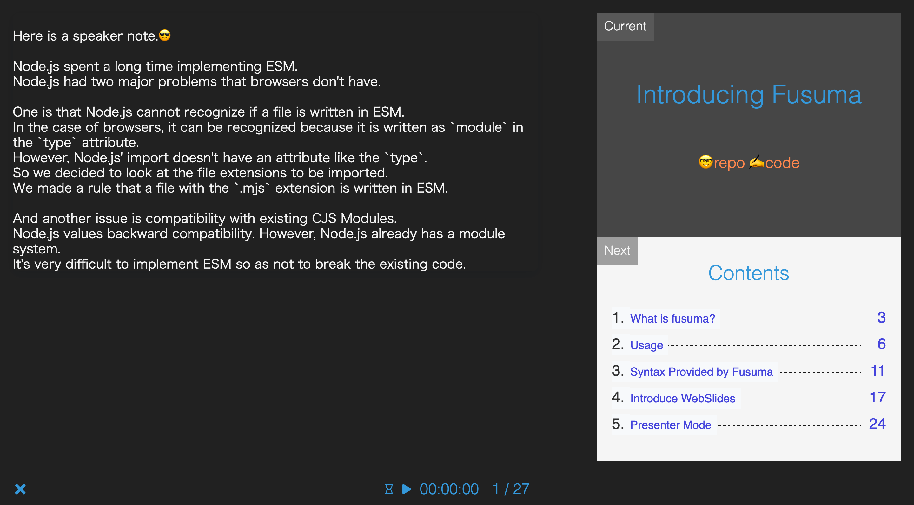

<div align="center">
  
</div>

<div align="center">
  <strong>📝 easily make slides with markdown</strong>
</div>

<br />

[](https://www.npmjs.com/package/fusuma)
[](https://travis-ci.org/hiroppy/fusuma)
[](https://ci.appveyor.com/project/hiroppy/fusuma)
[](https://codecov.io/gh/hiroppy/fusuma)

Just write the markdown and make the cool slide.

## Demos

- [introduction slide of Fusuma](https://hiroppy.github.io/fusuma/intro) [[repository](/samples/intro-with-separator)]
- [animation slide](https://hiroppy.github.io/fusuma/fx/) [[repository](/samples/fx)]
- [the present and future of JavaScript](https://slides.hiroppy.me/the-present-and-future-of-JavaScript/) [[repository](https://github.com/hiroppy/slides/tree/master/slides/the-present-and-future-of-JavaScript)]
- other my slide [[repository](https://github.com/hiroppy/slides#my-slides)]

## Install

Node versions > v8

```sh
$ npm i fusuma --save-dev # or npm i fusuma -g

# if you want to use yarn
$ yarn add fusuma --dev
```

## Procedure

Just execute the following three lines for executing, generating and deploying slides!

```sh
$ npm i fusuma -D
$ npx fusuma init
$ mkdir slides && echo '# Hello😄' > slides/title.md

# --- Tree ---
$ tree -a
.
├── .fusumarc.yml
└── slides
    └── title.md

1 directory, 2 files

# --- executable tasks---
$ npx fusuma start    # development
$ npx fusuma build    # build as NODE_ENV=production
$ npx fusuma deploy   # deploy to github pages
$ npx fusuma pdf      # export as PDF from HTML
```

When `npx fusuma start` is executed, it is output as follows.


## Feature

- support [bespoke.js](https://github.com/bespokejs/bespoke)
- support [Presentation API](https://developer.mozilla.org/en-US/docs/Web/API/Presentation_API)
- support animations of page transition and lazy-load
- support SNS, fullscreen, Presenter Mode
- support development mode, production build and deploy
- overwriting of js and css is possible
- export as PDF

## Directory Structure

Please see [samples](/samples) or [Verification Repository](https://github.com/issue-verifier/fusuma).

Slide order is numeric, alphabetical.

```
.
├── .fusumarc.yml       <-- a configuration file
├── index.js            <-- optional for rewriting
├── slides              <-- slides written by Markdown or HTML
│   ├── 0-title.md
│   ├── 01-content.md
│   ├── 02-body
│   │   └── 0-title.md
│   └── 03-end.md
└── style.css           <-- optional for rewriting

2 directories, 7 files
```

Also, slides can be divided by `---` too.

```md
<!-- background: title -->

# Title

---

<!-- background: red -->

## Hi😜

This page is the next page of the title.
```

## Usage

```sh
   fusuma 0.5.3 - CLI for easily make slides with markdown

   USAGE

     fusuma <command> [options]

   COMMANDS

     init                Create a configure file
     start               Start with webpack-serve
     build               Build with webpack
     deploy              Deploy to GitHub pages
     pdf                 Export as PDF
     help <command>      Display help for a specific command

   GLOBAL OPTIONS

     -h, --help         Display help
     -V, --version      Display version
     --no-color         Disable colors
     --quiet            Quiet mode - only displays warn and error messages
     -v, --verbose      Verbose mode - will also output debug messages
```

## Configuration File

Support for `yaml` and `js`.

### .fusumarc.yml

<details>

```yaml
meta:
  url: https://slides.hiroppy.me
  name: the present and future of JavaScript
  author: Yuta Hiroto
  description: Explain how specifications are determined and how it will be in the future.
  thumbnail: https://avatars1.githubusercontent.com/u/1725583?v=4&s=200
  siteName: slides.hiroppy.me
  repositoryUrl: https://github.com/hiroppy/fusuma
  sns:
    - twitter
    - hatena
slide:
  theme: nebula
  sidebar: true
  targetBlank: true
extends:
  js: index.js
  css: style.css
```

</details>

### .fusumarc.js

<details>

```js
module.exports = {
  meta: {
    url: 'https://slide.hiroppy.me',
    name: 'test-test',
    author: 'hiroppy',
    description: 'test',
    thumbnail: 'url',
    siteName: 'siteName',
    sns: ['twitter', 'hatena'],
    repositoryUrl: 'https://github.com/hiroppy/fusuma'
  },
  slide: {
    theme: 'nebula',
    sidebar: true,
    targetBlank: true
  },
  extends: {
    js: 'index.js',
    css: 'style.css'
  }
};
```

</details>

### Themes

- Cube
- Voltaire
- Nebula (default)

https://github.com/bespokejs/bespoke#themes

Or you can specify a theme.

## Slide Syntax

See [docs/slide.md](./docs/slide.md).

## Presenter Mode

Click the rocket(:rocket:) icon from the bottom right menu(三) and then slides for presentation will be opened as a new window, and an already open window will be windows for presenters.

Host: `?presenter=host`  
View: `?presenter=view`



## Library

- Bespoke
- Babel
- webpack
- Postcss
- Prism
- React
- Workbox
- font-awesome

## API

```js
const { start, build, deploy, pdf } = require('fusuma');
```

## Articles

- [Markdown だけで綺麗なスライドを作る CLI を作っている](http://blog.hiroppy.me/entry/fusuma)
- [Introduce Fusuma that is a helper for creating a slide](https://medium.com/@about_hiroppy/introduce-fusuma-that-is-a-helper-for-creating-a-slide-10d54775f255)
- [Introducing Fusuma: A helper for creating slides with markdown](https://dev.to/abouthiroppy/introduce-fusuma-that-is-a-helper-for-creating-a-slide-536)
