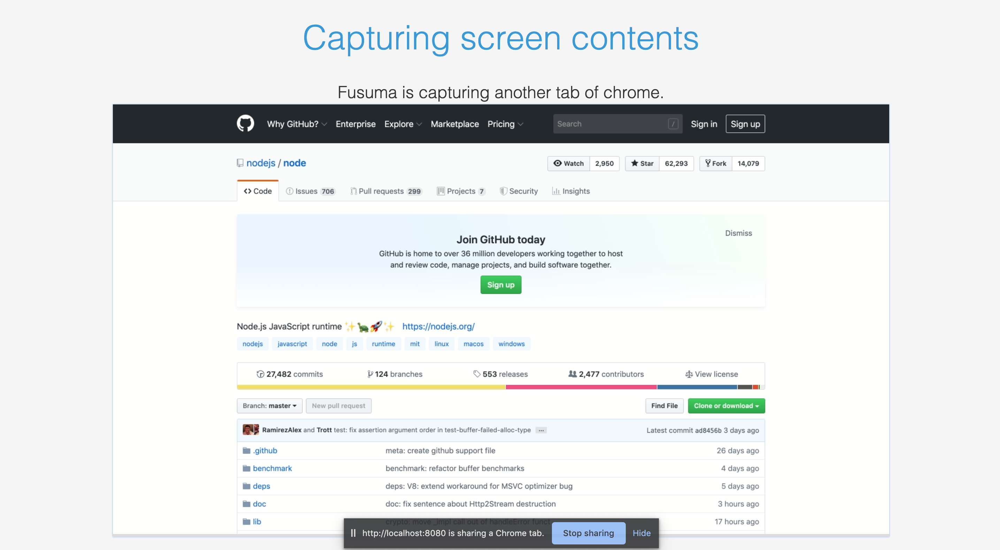

<!-- section-title: Syntax Provided by Fusuma -->

## Syntaxes Provided by Fusuma

Basically, you don't have to code js and css so you can focus on coding Markdown to create your slide.  
Fusuma provides some features using HTML comments.

---

## Splitting Slides

```markdown
## Hello

This is the first slide.

---

## ✌️

This is the second slide.
```

<br />

You can split slides within the same file by using `---` syntax.

---

## Adding Classes

```markdown
<!-- classes: title, main -->

## Hello
```

```css
.title {
  color: #3498db;
}

.main {
  background: #f5f5f5;
}
```

<br />

These classes attach to the top level of a slide container.

---

## Creating `div` tag with class name

This example uses grid classes(`.grid`, `.column`).

```md
<!-- block-start: grid -->

  <!-- block-start: column -->

left

  <!-- block-end -->

  <!-- block-start: column -->

right

  <!-- block-end -->

<!-- block-end -->

The class name of `<!-- block-start -->` isn't mandatory.
```

👇

<!-- block-start: grid -->

<!-- block-start: column -->

left

<!-- block-end -->

<!-- block-start: column -->

right

<!-- block-end -->

<!-- block-end -->

The class name of `<!-- block-start -->` isn't mandatory.

---

## Setting Background

<!-- background: '../assets/background.jpeg' -->

```md
<!-- background: '../assets/background.jpeg' -->

Also, you can specify hexadecimal and names.

<!-- background: #f5f5f5 -->
<!-- background: green -->
```

---

## Declaring Section Title

```md
<!-- section-title: this is the second slide! -->

## ✌️
```

```css
/* output with this class name */
.section-title {
  color: #ff0;
  background: #ccc;
}
```

<br />

Makes explicit declarations to create an agenda.  
In addition, it is also added to sidebar's list.

---

## Generating Agenda

```md
## Contents

<!-- contents -->
```

<br />

Converts the page number and title name specified by `section-title` into a ToC component.

---

## Adding Speaker Note

```md
<!-- note
This is a speaker note!!
This sentence can be seen when using Presenter Mode.

😍
-->

## Hello!!
```

<br />

Displays notes for each slide in presenter mode.

---

## Executing JavaScript Code

Executes JavaScript code when the button is clicked. If you use `console.log`, the context will be outputted.

<!-- executable-code -->

```javascript
alert('hi!!');
console.log('hi!');
```

```md
<!-- executable-code -->

\`\`\`javascript
alert('hi!!');
console.log('hi!');
\`\`\`
```

---

## Capturing Screen Contents

<!-- block-start: grid -->

<!-- block-start: column -->

```md
## Capture Screen Contents

<!-- screen -->
```



<!-- block-end -->

<!-- block-start: column -->

Your screen captures on the slide, but this feature can run only in Presenter Mode so this feature will help **live coding** etc. You can choose **your local screen** or **application window** or **browser tab** as output. See [Screen Capture API](https://developer.mozilla.org/en-US/docs/Web/API/Screen_Capture_API/Using_Screen_Capture) for more details.

<!-- block-end -->
<!-- block-end -->

---

## Generating QR Code

```md
<!-- qr: https://github.com/hiroppy/fusuma -->
```

<!-- qr: https://github.com/hiroppy/fusuma -->
