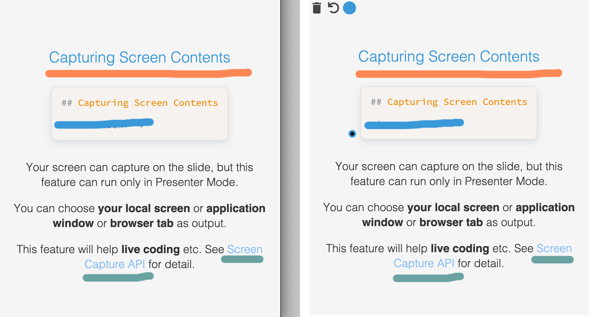

<!-- section-title: Presenter Mode -->

## Presenter Mode

Recommend using this feature if you give a speech.

<br />

Fusuma is compatible with [Presentation API](https://developer.mozilla.org/en-US/docs/Web/API/Presentation_API),

but you can also use this mode if you use browsers which don't have Presentation API because Fusuma can fallback to using localstorage. **Since iframes are used internally, recommend that you use this feature in your localhost.**

---

## Procedure

- 1. Open Sidebar(click the bottom right button(三))
- 2. Click the PC monitor icon
- 3. If you use Chrome/Firefox, you will be able to choose select a cast device
- 4. If you use browser that don't support Presentation API, a new window will be created

---

## Host Screen

import { HostScreen } from '../scripts/Presenter';

<HostScreen />

---

<!-- note
Hi, this is a speaker note!!
-->

## Speaker Note

This page is written with the following Markdown.
Let's try to run the presenter mode and check the note.

```md
<!-- note
Hi, this is a speaker note!!
-->

## Speaker Note

This page is written with the following Markdown.
Let's try to run the presenter mode and check the note.
```

---

## Slide Timeline and Recording Your Voice

Timeline and the recording voice are optional but these features will help you to practice making a speech.

The timeline can be time travel.


---

## Drawing (experimental)

When you write characters on the host side, it will be reflected on the client side in real time.


