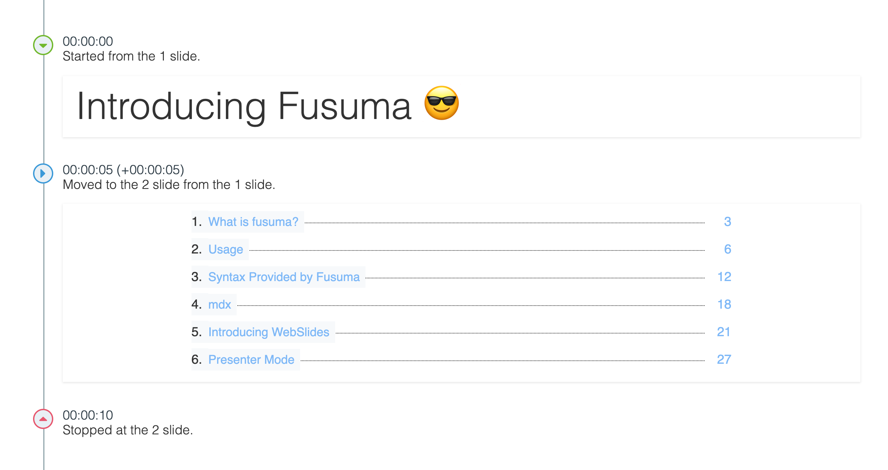

<!-- sectionTitle: Presenter Mode -->

## Presenter Mode

Recommend using this feature if you give a speech.

<br />

Fusuma is compatible with [Presentation API](https://developer.mozilla.org/en-US/docs/Web/API/Presentation_API),

but you can also use this mode if you use browsers which don't have Presentation API

because Fusuma can fallback to using localstorage.

<br />

**Since iframes are used internally, recommend that you use this feature in your localhost.**

---

## Setup

- 1. open Sidebar(click the bottom right button(三))
- 2. click the PC monitor icon
- 3. if you use Chrome, you can choose select cast device
- 4. if you use a browser that does not support Presentation API, a new window will be created

---

## Host Screen

import { HostScreen } from '../scripts/Presenter';

<HostScreen />

---

<!-- note
This is a speaker note!!
This sentence can be seen when using Presenter Mode.
-->

## Speaker Note

This page is written with the following Markdown.

```md
<!-- note
This is a speaker note!!
This sentence can be seen when using Presenter Mode.
-->
```

---

## Slide Timeline

When you start the timer, the timeline will be recorded.



By recording audio, you can also do time travel.

---

## Drawing

When you write characters on the host side, it will be reflected on the client side in real time.


